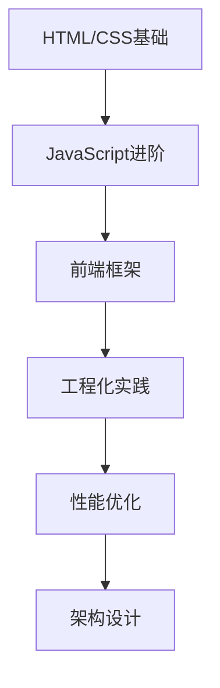
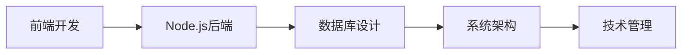

# Hexo技术博客未来路线图：从个人博客到技术品牌的演进

## 前言

技术博客不仅是知识分享的载体，更是个人技术品牌的重要组成部分。本文将为你规划一条从技术博客到技术品牌的完整演进路线，帮助你在技术道路上持续成长，最终建立具有影响力的个人技术品牌。

## 博客发展阶段

### 1. 起步阶段（0-6个月）
**目标**：建立稳定的内容输出机制
- **内容策略**：每周1-2篇技术文章
- **技术栈**：掌握Hexo基础配置
- **技能提升**：Markdown熟练、基础前端知识
- **里程碑**：完成50篇原创文章

#### 起步清单
```markdown
## 起步阶段任务清单
- [ ] 完成Hexo环境搭建
- [ ] 建立内容分类体系
- [ ] 制定写作计划
- [ ] 学习SEO基础
- [ ] 建立社交媒体账号
- [ ] 加入技术社区
```

### 2. 成长阶段（6-18个月）
**目标**：提升内容质量和影响力
- **内容策略**：深度技术文章、系列教程
- **技术栈**：主题定制、性能优化
- **技能提升**：前端开发、UI/UX设计
- **里程碑**：月均访问量1万+

#### 成长策略
```javascript
// 内容规划工具
class ContentPlanner {
  constructor() {
    this.topics = [
      '前端框架深度解析',
      '性能优化实战',
      '工程化实践',
      '新技术探索'
    ];
  }

  generateMonthlyPlan() {
    return {
      week1: '技术原理文章',
      week2: '实战教程',
      week3: '工具推荐',
      week4: '技术趋势分析'
    };
  }
}
```

### 3. 成熟阶段（18-36个月）
**目标**：建立技术权威地位
- **内容策略**：技术专栏、开源项目
- **技术栈**：全栈开发、DevOps
- **技能提升**：技术演讲、社区贡献
- **里程碑**：技术社区认可、合作机会

### 4. 品牌阶段（36个月+）
**目标**：成为技术意见领袖
- **内容策略**：技术趋势预测、行业洞察
- **技术栈**：技术架构、团队管理
- **技能提升**：技术布道、商业思维
- **里程碑**：出版书籍、技术大会演讲

## 技术能力演进

### 1. 前端技术栈


#### 学习路径
```javascript
// 技术学习路线图
const frontendRoadmap = {
  fundamentals: ['HTML5', 'CSS3', 'JavaScript ES6+'],
  frameworks: ['React', 'Vue', 'Angular'],
  tools: ['Webpack', 'Vite', 'Rollup'],
  advanced: ['TypeScript', 'WebAssembly', 'PWA']
};
```

### 2. 后端技术栈
```yaml
# 后端技术演进
year_1:
  - Node.js基础
  - Express框架
  - MongoDB

year_2:
  - 微服务架构
  - Docker容器化
  - Kubernetes

year_3:
  - 云原生应用
  - 分布式系统
  - 高可用架构
```

### 3. DevOps技能树
```bash
# DevOps技能发展
# 阶段1：基础自动化
- Git版本控制
- CI/CD流水线
- 基础监控

# 阶段2：容器化
- Docker容器
- Kubernetes编排
- 服务网格

# 阶段3：云原生
- 微服务架构
- 服务网格
- 混沌工程
```

## 内容策略演进

### 1. 内容类型发展
```markdown
## 内容类型演进
### 初级阶段
- 技术笔记
- 学习心得
- 问题记录

### 中级阶段
- 技术教程
- 最佳实践
- 性能优化

### 高级阶段
- 架构设计
- 技术决策
- 行业分析
```

### 2. 内容质量提升
```javascript
// 内容质量评估工具
class ContentQuality {
  constructor() {
    this.metrics = {
      technicalDepth: 0,
      practicalValue: 0,
      originality: 0,
      presentation: 0
    };
  }

  evaluate(post) {
    return {
      score: this.calculateScore(post),
      suggestions: this.generateSuggestions(post),
      nextSteps: this.planImprovement(post)
    };
  }

  calculateScore(post) {
    let score = 0;
    score += post.codeExamples ? 25 : 0;
    score += post.explanations ? 25 : 0;
    score += post.realWorldCases ? 25 : 0;
    score += post.visualAids ? 25 : 0;
    return score;
  }
}
```

## 技术品牌建设

### 1. 个人品牌定位
```markdown
## 品牌定位框架
### 核心价值
- 技术深度
- 实用性强
- 持续创新

### 目标受众
- 初级开发者
- 中级工程师
- 技术管理者

### 差异化优势
- 实战经验
- 系统思维
- 前瞻性洞察
```

### 2. 多渠道内容分发
```yaml
# 内容分发策略
primary:
  platform: 个人博客
  frequency: 每周2-3篇
  format: 深度技术文章

secondary:
  platform: 
    - 知乎专栏
    - 掘金
    - CSDN
  frequency: 每周1篇
  format: 技术要点提炼

social:
  platform:
    - Twitter
    - LinkedIn
    - 微信公众号
  frequency: 每日分享
  format: 技术洞察
```

## 商业化路径

### 1. 变现模式
```javascript
// 商业化策略
const monetizationStrategies = {
  earlyStage: [
    '技术咨询',
    '代码审查',
    '付费专栏'
  ],
  
  growthStage: [
    '在线课程',
    '企业培训',
    '技术书籍'
  ],
  
  matureStage: [
    '技术产品',
    'SaaS服务',
    '技术投资'
  ]
};
```

### 2. 收入模型
```markdown
## 收入构成预测
### 第1年
- 广告收入: 5%
- 咨询收入: 20%
- 课程收入: 75%

### 第2年
- 广告收入: 10%
- 咨询收入: 30%
- 课程收入: 50%
- 产品收入: 10%

### 第3年
- 广告收入: 15%
- 咨询收入: 25%
- 课程收入: 30%
- 产品收入: 30%
```

## 技术影响力建设

### 1. 开源贡献
```bash
# 开源项目规划
# 阶段1：工具类项目
- Hexo插件开发
- 开发工具改进
- 自动化脚本

# 阶段2：框架类项目
- 前端组件库
- 构建工具优化
- 性能监控工具

# 阶段3：平台类项目
- 技术博客平台
- 开发者工具集
- 技术社区平台
```

### 2. 社区参与
```markdown
## 社区参与计划
### 线上活动
- 技术直播分享
- 开源项目维护
- 技术问答社区

### 线下活动
- 技术大会演讲
- 工作坊主持
- 技术沙龙分享
```

## 技术栈演进

### 1. 全栈能力发展


### 2. 新兴技术跟踪
```yaml
# 技术雷达
adopt:
  - TypeScript
  - React Hooks
  - Serverless

trial:
  - WebAssembly
  - Edge Computing
  - AI辅助开发

assess:
  - Web3
  - Quantum Computing
  - Brain-Computer Interface
```

## 数据驱动优化

### 1. 关键指标监控
```javascript
// 博客数据分析
class BlogAnalytics {
  constructor() {
    this.metrics = {
      traffic: ['PV', 'UV', '停留时间'],
      engagement: ['评论数', '分享数', '收藏数'],
      conversion: ['订阅率', '付费率', '推荐率']
    };
  }

  trackGrowth() {
    return {
      monthlyGrowth: this.calculateGrowth(),
      topContent: this.identifyTopContent(),
      userFeedback: this.collectFeedback()
    };
  }
}
```

### 2. A/B测试框架
```javascript
// 内容优化实验
class ContentExperiment {
  constructor() {
    this.experiments = {
      titleFormats: ['问题式', '列表式', '指南式'],
      contentLength: ['短文', '中篇', '长文'],
      visualElements: ['代码块', '图表', '视频']
    };
  }

  runExperiment(type, variants) {
    // 实施A/B测试
    // 收集数据
    // 分析结果
    // 优化策略
  }
}
```

## 长期发展规划

### 1. 三年目标设定
```markdown
## 2024-2027发展规划
### 2024年：基础建设
- 完成100篇高质量技术文章
- 建立稳定读者群体（1000+订阅）
- 开发3个开源项目

### 2025年：影响力扩展
- 月均访问量10万+
- 出版第一本技术书籍
- 成为技术大会讲师

### 2026年：品牌成熟
- 建立技术团队
- 推出技术产品
- 实现年收入50万+
```

### 2. 技能认证计划
```yaml
# 认证路径
certifications:
  cloud:
    - AWS Solutions Architect
    - Google Cloud Professional
    - Azure Developer Associate
  
  frontend:
    - React Developer Certified
    - Vue.js Certified
    - TypeScript Expert
  
  backend:
    - Node.js Certified
    - Kubernetes Administrator
    - Microservices Architect
```

## 风险管理

### 1. 技术风险
```markdown
## 风险识别与应对
### 技术过时
- 风险：技术栈被淘汰
- 应对：持续学习，技术雷达跟踪

### 平台依赖
- 风险：过度依赖单一平台
- 应对：多平台分发，自建平台

### 内容同质化
- 风险：内容缺乏差异化
- 应对：深度专业化，独特视角
```

### 2. 市场风险
```javascript
// 市场适应性分析
class MarketAnalysis {
  analyzeTrends() {
    return {
      emergingTech: this.trackEmergingTech(),
      audienceNeeds: this.identifyNeeds(),
      competitive: this.analyzeCompetition()
    };
  }

  adaptStrategy(analysis) {
    // 根据市场变化调整策略
    // 保持灵活性和适应性
  }
}
```

## 成功指标

### 1. 量化指标
```yaml
# KPI设定
traffic:
  monthly_pv: 100000
  monthly_uv: 20000
  avg_session_duration: 3min

engagement:
  email_subscribers: 5000
  social_followers: 10000
  community_members: 2000

revenue:
  monthly_income: 10000
  product_sales: 50000
  consulting_revenue: 30000
```

### 2. 质化指标
```markdown
## 影响力指标
### 行业认可
- 技术大会邀请
- 媒体采访报道
- 同行推荐

### 社区贡献
- 开源项目star数
- 技术问答采纳率
- 社区活跃度

### 个人成长
- 技术深度提升
- 表达能力增强
- 商业思维建立
```

## 持续学习体系

### 1. 学习计划
```markdown
## 每日学习计划
### 技术学习（2小时）
- 阅读技术文档
- 实践新技术
- 代码review

### 内容创作（1小时）
- 文章构思
- 素材收集
- 写作练习

### 社区参与（30分钟）
- 技术讨论
- 问题解答
- 网络建设
```

### 2. 反馈循环
```javascript
// 持续改进机制
class ContinuousImprovement {
  collectFeedback() {
    return {
      reader: this.surveyReaders(),
      analytics: this.analyzeData(),
      peers: this.getPeerReview()
    };
  }

  implementChanges(feedback) {
    // 优先级排序
    // 实施改进
    // 效果验证
    // 循环优化
  }
}
```

## 结语

技术博客到技术品牌的演进是一个长期而持续的过程。关键在于保持技术热情，持续学习成长，始终以价值创造为核心。记住，技术品牌不是一蹴而就的，而是通过持续的内容创作、技术分享和社区贡献逐步建立的。

保持初心，持续精进，让你的技术博客成为技术世界的灯塔！
